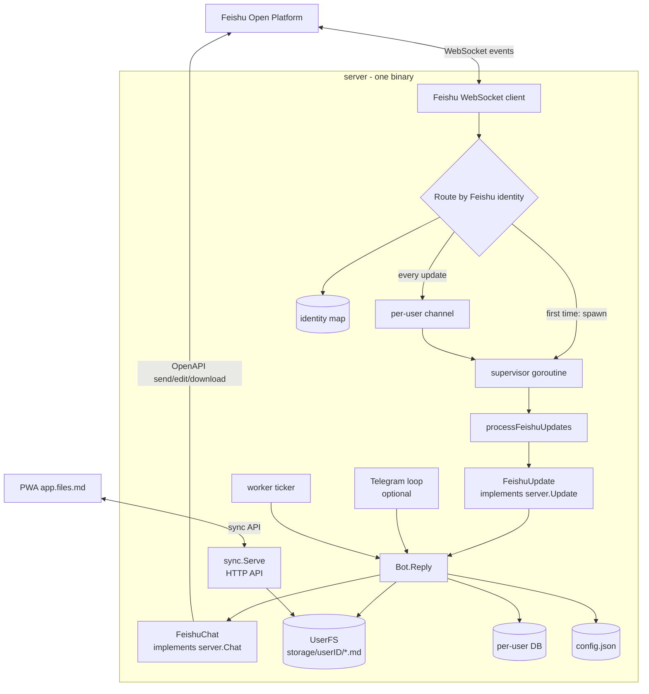
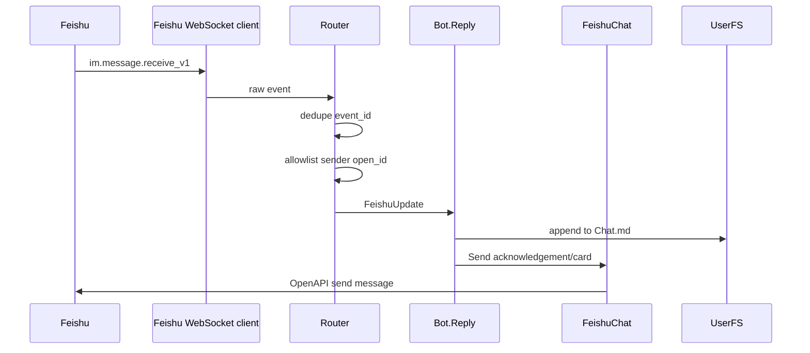
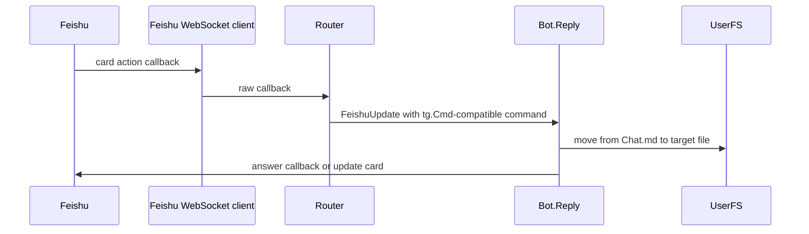

# Feishu bot

Technical design for using a Feishu/Lark app as a capture surface for files.md.

The goal is to let a user write to a Feishu bot chat and have the server save
that content into the same plain Markdown file tree used by the web app and the
Telegram bot.

## Product direction

Feishu should be treated as another low-friction input surface, not as a new
knowledge-management system.

The default path is:

1. Save incoming messages to `Chat.md`.
2. Acknowledge the save in Feishu.
3. Offer lightweight actions to move the entry to journal, later, a checklist,
   or a file.

Automatic classification should not be the default behavior. It is too easy to
hide a wrong decision from the user. Classification can be added later as a
suggestion layer, while the original entry remains in `Chat.md`.

## High-level architecture



The Feishu integration should reuse the existing `Bot.Reply` flow. The new code
is an adapter layer:

- `FeishuUpdate` converts Feishu events and card callbacks into the existing
  `server.Update` interface.
- `FeishuChat` converts the existing `server.Chat` operations into Feishu
  OpenAPI calls.
- The router keeps the existing per-user sequential processing model so one
  user's file writes do not race each other.

## Why long connection mode

Feishu supports a long connection mode where the app opens an outbound WebSocket
connection to receive events.

This fits files.md better than webhook mode for a personal deployment:

- No public inbound HTTP endpoint is required.
- The server can run on a local machine, NAS, private VPS, or internal host.
- The runtime model is close to Telegram long polling, which this repository
  already uses.

Message sending still uses Feishu OpenAPI with app credentials and cached tenant
tokens. Long connection mode only changes how incoming events and callbacks are
received.

## MVP scope

The first implementation should be intentionally narrow:

- Receive one-to-one bot messages.
- Allowlist one or more Feishu `open_id`s.
- Save text messages to `Chat.md`.
- Support the existing journal shortcut suffixes, such as `jj`.
- Support simple slash commands:
  - `/later text`
  - `/journal text`
  - `/read text`
  - `/watch text`
  - `/shop text`
- Send a short acknowledgement message.
- Optionally send a small interactive card with:
  - Journal
  - Later
  - Read
  - Watch
  - Shop
  - OK

Out of MVP:

- Full inline file search.
- Multi-tenant productization.
- Group chat routing.
- Habits web app integration.
- Rich schedule pickers.
- Voice transcription.
- AI classification.

## Proposed package layout

```text
server/feishu/
  client.go       # WebSocket client bootstrapping
  router.go       # event dedupe, allowlist, per-user queues
  update.go       # FeishuUpdate implements server.Update
  chat.go         # FeishuChat implements server.Chat
  card.go         # tg.Keyboard -> Feishu interactive card
  identity.go     # Feishu identity -> internal userID mapping
  media.go        # image/file download helpers
```

`cmd/server/server.go` can start Feishu conditionally when `FEISHU_APP_ID` and
`FEISHU_APP_SECRET` are present. Telegram should remain optional and unchanged.

## Configuration

Suggested environment variables:

```text
FEISHU_APP_ID=
FEISHU_APP_SECRET=
FEISHU_ALLOWED_OPEN_IDS=
FEISHU_DEFAULT_USER_ID=
FEISHU_ENABLE_CARD_ACTIONS=false
```

For a personal single-user setup, `FEISHU_DEFAULT_USER_ID` can point to one
existing files.md user directory. This avoids a broad user identity refactor in
the first version.

Current implementation status:

- `FEISHU_APP_ID` and `FEISHU_APP_SECRET` enable the Feishu long connection
  client.
- `FEISHU_ALLOWED_OPEN_IDS` is a comma-separated sender allowlist.
- `FEISHU_DEFAULT_USER_ID` routes allowed senders to one numeric files.md user
  directory.
- `FEISHU_ENABLE_CARD_ACTIONS` controls whether `tg.Keyboard` replies are
  rendered as Feishu interactive cards. It defaults to `false` because first
  deployment should verify long connection and message saving before depending
  on card callback permissions. When this is set to `true`, the Feishu app also
  needs the `card.action.trigger` callback subscription.

Minimal local run:

```bash
FEISHU_APP_ID=cli_xxx \
FEISHU_APP_SECRET=xxx \
FEISHU_ALLOWED_OPEN_IDS=ou_xxx \
FEISHU_DEFAULT_USER_ID=10001 \
go run ./cmd/server
```

Then send a direct message to the Feishu bot and check:

```text
storage/10001/Chat.md
```

For multi-user support, add a persistent identity map:

```json
{
  "feishu:tenant_key:open_id": 10001
}
```

The current core code uses `int64` user IDs in `server.Update`, `server.Chat`,
`db`, `userconfig`, and `fs.NewUserFS`. A full string-based identity refactor is
cleaner long term, but it is not required for a personal MVP.

## Event flow

### Text message



### Card action



## Mapping Feishu events to `server.Update`

| `server.Update` method | Feishu source |
| --- | --- |
| `MsgText()` | message content text |
| `UserID()` | mapped internal user ID |
| `Cmd()` | slash command or card action payload |
| `CallbackQueryID()` | card action callback ID |
| `PhotoOrImageID()` | image key or file key |
| `Caption()` | optional message caption text |
| `MsgID()` | stable mapped message ID |
| `Time()` | Feishu event/message timestamp |
| `ChannelID()` | group chat ID, deferred for MVP |
| `ChannelName()` | group chat name, deferred for MVP |

Feishu text content arrives as JSON, not Telegram entities. The MVP should
extract plain text first. Rich text, mentions, links, and images can be converted
to Markdown incrementally.

## Mapping `server.Chat` to Feishu

| `server.Chat` method | Feishu implementation |
| --- | --- |
| `Send` | send text or interactive card message |
| `Edit` | update card or send replacement message |
| `Del` | delete message if available, otherwise no-op |
| `SendReaction` | use reaction API if available, otherwise no-op |
| `AnswerCallbackQuery` | acknowledge card callback |
| `AnswerInlineQuery` | no-op for MVP |
| `DownloadFile` | download image/file by message resource key |

The existing `tg.Keyboard` type can be reused as the internal button model.
`FeishuChat` should render it into a Feishu interactive card.

## File-writing behavior

The default save path should preserve files.md's current chat shape:

```md
#### 22 May, Friday
- [ ] `10:30` Something I want to remember
```

Direct shortcuts can bypass `Chat.md` only when the user is explicit:

- `text jj` writes to journal.
- `/later text` writes to `Later.md`.
- `/read text` writes to `Read.md`.

For AI or heuristic classification, keep the source entry in `Chat.md` and add a
suggested action card. Do not silently move the only copy.

## Reliability and safety

- Deduplicate by Feishu event ID and message ID.
- Process one user's events sequentially.
- Keep Feishu processing asynchronous enough that callbacks can be acknowledged
  quickly.
- Allowlist Feishu sender IDs for personal deployments.
- Store app credentials only in environment variables.
- Keep daily git backups for the target Markdown directory.
- Treat Feishu as a cloud transport, not a private local-only surface.

## Implementation order

1. Add Feishu config fields.
2. Add `server/feishu` with a minimal WebSocket client and text event logging.
3. Add identity mapping for the personal single-user case.
4. Implement `FeishuUpdate` for plain text messages.
5. Implement `FeishuChat.Send` for acknowledgement messages.
6. Route events through existing per-user workers and `Bot.Reply`.
7. Add slash command parsing for MVP direct-save commands if existing shortcut
   handling is not enough.
8. Add basic interactive card rendering for `showMoveTo`.
9. Add image download and Markdown image insertion.
10. Add tests around update conversion, identity mapping, and card command
    payloads.

## Open decisions

- Whether personal deployment should write directly to an existing Markdown
  directory or a generated `storage/<userID>` directory with a symlink.
- Whether group chat should be ignored or routed by sender.
- Whether Feishu cards should be enabled in MVP or deferred in favor of text
  commands.
- Whether to keep `int64` user IDs for the first version or refactor identity
  to strings before adding Feishu.
